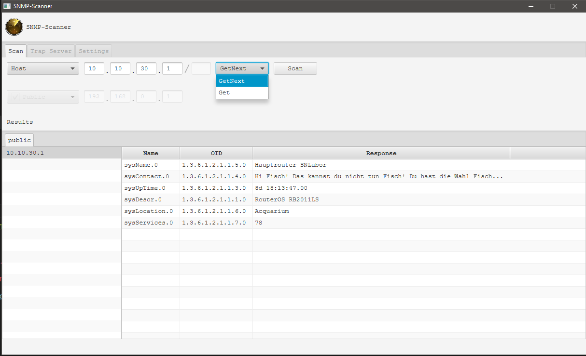

# Contents


1. [General](#general)
    * [Introduction](#introduction)
    * [Dependencies](#dependencies)
    * [Installation/Start](#installationstart)
2. [SNMP Scanner](#snmp-scanner)
    * [Status](#status)
    * [Start Scanning](#start-scanning)
    * [Trap Listener](#trap-listener)

# General

## Introduction
SNMP Scanner Tool welches in Java geschrieben wurde.

## Dependencies
Das Programm braucht lediglich nur die Bibliothek
[tnm4j](https://github.com/soulwing/tnm4j). \
Es wurde die Java Version 8 genutzt und die tnm4j Version 11.

## Installation/Start
Zum Installieren muss die `SNMPScanner.jar` Datei im Release Commit
heruntergeladen werden. Dann um das Programm zu starten muss Java 8 auf dem Rechner
installiert sein. Letztendlich genügt es die `SNMPScanner.jar` Datei mit einem
Doppelklick zu starten oder den Befehl `java -jar SNMPScanner.jar` in der Konsole
auszuführen. Falls man die Source Files selbst kompilieren möchte kann man das
über Maven machen und zwar mit dem Befehl `mvn package`. Falls alles funktioniert
hat sollte man im Ordner `target` zwei Jar-Dateien finden mit den Namen
`SNMPScanner-0.5.jar` und `SNMPScanner-0.5-jar-with-dependencies.jar`.
Die Jar-Datei mit den Dependencies, heißt `SNMPScanner-0.5-jar-with-dependencies.jar`,
kann dann über den Befehl `java -jar SNMPScanner-0.5-jar-with-dependencies.jar` ausgeführt werden.

# SNMP Scanner
## Status
Derzeit muss der Großteil des Programms noch über den Code geändert werden.
Die GUI kann jedoch schon einen Host, ein Netzwerk oder eine Range scannen.
Die Ergebnisse werden dann in der GUI dargestellt, bei keinem Ergebnis oder
Misserfolg bekommt man einen Output in der Konsole.

### Start Scanning
Um einen Scan, für eine IP auszuführen muss man im Feld die IP des
Hosts eintragen und dann die Methode auswählen, also `Get` oder `GetNext`.
Per Klick auf Scan wird schon eine Anfrage geschickt. Falls eine Request an
ein ganzes Netzwerk oder nur an eine Range geschickt werden sollte, kann
das in der ComboBox geändert werden.

#### Example



### Trap Listener
Für einen Listener wird eine neue Instanz der Klasse ```SNMPListener```
erstellt. Um den Listener dann noch zu starten wird die ``start`` Methode
des Objekts aufgerufen. Der Listener kann dann wieder über die Methode
``stop`` gestoppt werden. Damit Traps nicht nur vom eigenem Computer
gesendet werden können, muss noch eine Firewall Regel erstellt
werden. Und zwar eine eingehende Regel für UDP Protokolle, welche den
Port für alle Netzwerke (Private, Öffentlich und Domäne) zulässt.

#### Example

```java

import it.duck.sanner.listener.SNMPListener;

class TrapListenerExample {

    private static int PORT = 10124;

    // Die Ergebnisse werden in der Konsole ausgegeben
    public static void main(String[] args) {
        // Der Listener wird auf den Port 10124 hören
        SNMPListener listener = new SNMPListener(PORT);
        // Der Handler wird registriert und somit startet der Listener
        listener.start();
        // Für das Beispiel wird 6 Sekunden lang gewartet
        try {
            Thread.sleep(6000);
        } catch (InterruptedException e) {
            System.out.println("Sleep wurde unterbrochen!");
        } finally {
            // Zum Schluss muss der Listener noch gestoppt werden
            listener.stop();
        }
    }
}
```
