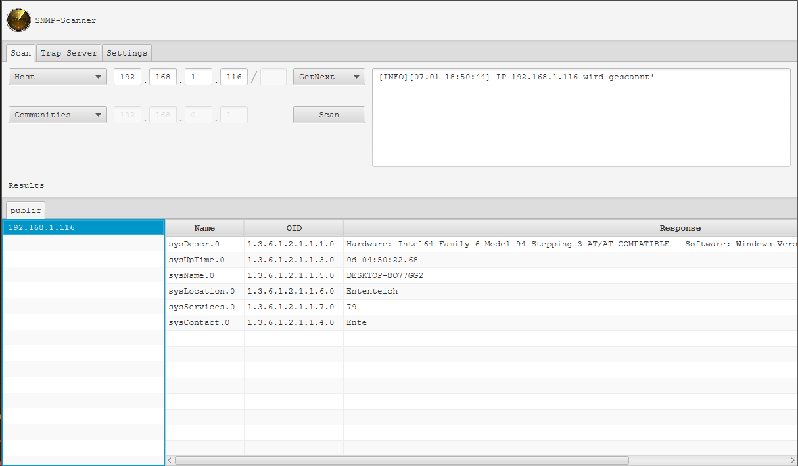
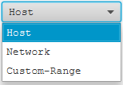
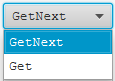
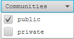
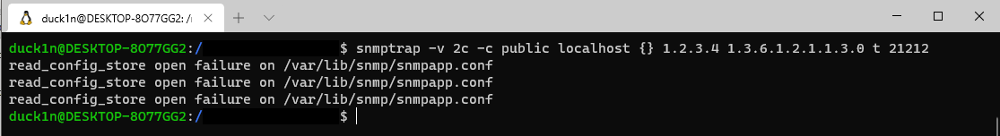
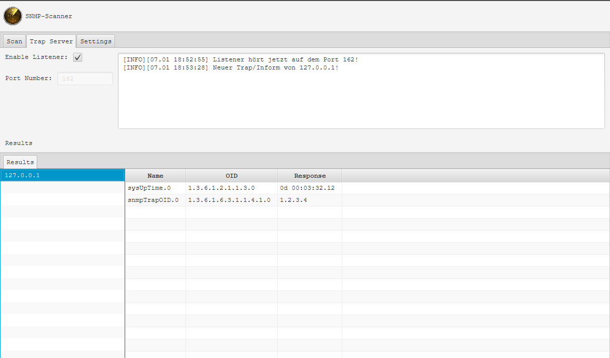
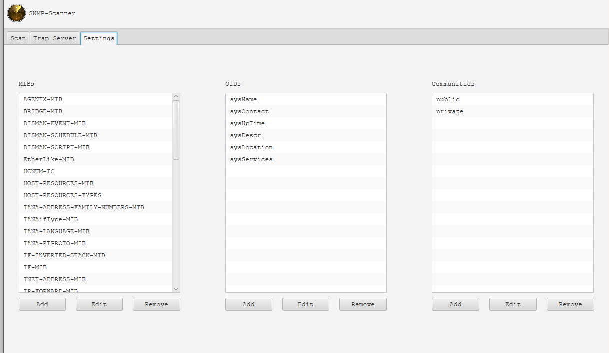

# Contents

1. [General](#general)
    * [Introduction](#introduction)
    * [Dependencies](#dependencies)
    * [Installation/Start](#installationstart)
2. [SNMP Scanner](#snmp-scanner)
    * [Status](#status)
    * [Planned](#planned) 
    * [Start Scanning](#start-scanning)
    * [Trap Listener](#trap-listener)

# General

## Introduction
SNMP Scanner Tool welches in Java geschrieben wurde.

## Dependencies
Das Programm braucht die Bibliotheken
[tnm4j](https://github.com/soulwing/tnm4j) und [controlsfx](https://github.com/controlsfx/controlsfx).

### Versions
 - Java: 1.8.0_201
 - tnm4j: 1.0.11
 - controlsfx: 8.40.18

## Installation/Start
Zum Installieren muss die `SNMPScanner.jar` Datei im Release Commit
heruntergeladen werden. Damit das Programm startet, muss Java 8 auf dem Rechner
installiert sein. Die `SNMPScanner.jar` Datei kann dann mit einem
Doppelklick ausgeführt werden. Ansonsten kann man auch den Befehl `java -jar SNMPScanner.jar` in der Konsole
ausführen. Falls man die Source Files selbst kompilieren möchte, kann man das
über Maven machen. Der Befehl dafür lautet `mvn package`. Falls das Kompilieren
ohne Probleme funktioniert hat, sollte man im Ordner `target` zwei Jar-Dateien finden mit den Namen
`SNMPScanner-1.0.jar` und `SNMPScanner-1.0-jar-with-dependencies.jar`.
Die Jar-Datei mit den Dependencies `SNMPScanner-1.0-jar-with-dependencies.jar`,
kann dann über den Befehl `java -jar SNMPScanner-1.0-jar-with-dependencies.jar` ausgeführt werden.

# SNMP Scanner
## Status
Das Programm ist komplett. 

### Funktionen

- Host Scannen
- Netzwerk Scannen
- Custom Range Scannen
- Get und GetNext werden unterstützt
- Anfragen können an verschiedene Communities gleichzeitig geschickt werden
- Traps/Informs können abgehört werden
- Der abzuhörende Port ist änderbar
- Es können eigene MIBs, OIDs und Communities hinzugefügt werden

## Start Scanning
Um eine einzelne IP zu scannen, muss man im Feld die IP des
Hosts eintragen. Rechts daneben kann dann die zu nutzende Methode ausgewählt werden, also `Get` oder `GetNext`.
Per Klick auf Scan wird schon eine Anfrage geschickt. Falls eine Request an
ein ganzes Netzwerk oder nur an eine Range geschickt werden soll, kann
das in der ComboBox links geändert werden. In der ComboBox `Communities` können
jeweils Communities aktiviert bzw. deaktiviert werden.

### Examples

#### GUI

#### Host, Network or Range

#### Method

#### Communities

## Trap Listener
Um den Listener zu starten, muss die CheckBox aktiviert werden. Vorher kann man
noch darunter den zu nutzenden Port deklarieren, falls das TextFeld leer bleibt
wird der Standardport `162` benutzt. Damit Traps nicht nur vom eigenem Computer
gesendet werden können, muss noch eine eingehende Firewall Regel erstellt
werden. Diese sollte UDP Protokoll auf dem bestimmten Port zulassen.

### Testing

Um selbst eine Trap zu senden, kann man das über einen Befehl auf einem Linuxsystem
erreichen. Ein Beispiel dafür wäre:

### Example

## Settings

In den Einstellungen können dann noch die MIBs, OIDs und Communities geändert werden.

